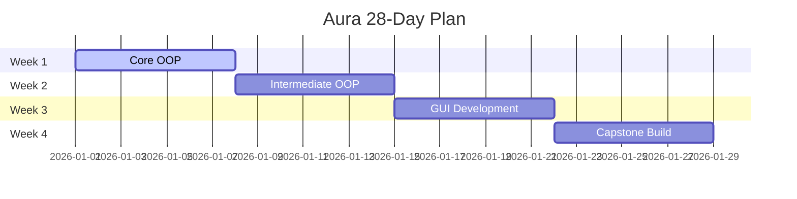

<!-- Project Aura – Phase 1 | Pro-Level README -->

# ⚡ Project Aura Phase 1  

---

**A 10‑member powerhouse team: learning, building & documenting the journey publicly.**

> Transparent learning.  
> Real teamwork.  
> Public progress.  
> _Welcome to Aura._

[Overview](#overview) • [Roadmap](#roadmap) • [Curriculum](#curriculum) • [Showcase](#showcase) • [Team](#team) • [Contribution](#contribution)

---

## 🚀 Overview

**Project Aura** is a public-facing learning sprint powered by top-creator philosophy.  
- 🟠 **Build in Public:** Weekly shares of progress, wins, and lessons.  
- 🟢 **Learn Out Loud:** Transform learning into content for GitHub, LinkedIn, Medium.  
- 🔵 **Document Everything:** Every commit and lesson is portfolio-ready proof of work.

> **Mission:** In 28 days, turn OOP + teamwork into a professional-grade portfolio project.

---

## 📈 Progress Dashboard

<!-- ========================
    PROGRESS DASHBOARD SECTION
    ======================== -->

<!-- Replace these chart/images with your current project stats.
     Update them regularly as your team progresses!
-->

<!-- Example Progress Chart -->

<!-- Example Contribution Graph -->

<!-- Example Progress Bars — edit values as you progress -->
 
<b>Week 1: Core OOP Basics</b>
In Progress " />
 
<b>Week 2: Intermediate OOP</b>
 Pending "/>
 
<b>Week 3: GUI Development</b>
 Pending"/>
 
<b>Week 4: Capstone Build</b>
 Pending "/>

<!-- You can add more charts, badges, stats, or even team contributions as images/SVGs! -->

---

## 🗺️ 28‑Day Roadmap

| **Week**    | **Focus**           | **Outcome**                    |
|:-----------:|:--------------------|:-------------------------------|
| **Week 1**  | Core OOP Basics     | Classes, Objects, Constructors |HAFE DONE
| **Week 2**  | Intermediate OOP    | Abstraction, Interfaces, Collections |
| **Week 3**  | GUI Development     | Swing, Events, Layouts         |
| **Week 4**  | Capstone Build      | Final Project & Documentation  |

---

## 📚 Curriculum (13 Chapters)

A thorough path for the entire team.

<b>Chapters 1–3: Foundations</b>

<ul>
  <li>OOP Principles</li>
  <li>Classes & Objects</li>
  <li>Constructors & Overloading</li>
</ul>

<b>Chapters 4–7: Core OOP</b>

<ul>
  <li>Static, GC, UML</li>
  <li>Inheritance, Polymorphism</li>
  <li>Composition, Aggregation</li>
</ul>

<b>Chapters 8–10: Advanced Concepts</b>

<ul>
  <li>Abstract Classes & Interfaces</li>
  <li>Collections & Generics</li>
  <li>File I/O & Serialization</li>
</ul>

<b>Chapters 11–13: GUI Application</b>

<ul>
  <li>Components</li>
  <li>Layouts</li>
  <li>Event Handling</li>
</ul>

---

## ✨ Showcase Strategy

**Our “Do → Show → Teach” growth formula:**  
- 🔨 **GitHub:** _Do the work_ → Commits, PRs, branch management.  
- 🗣️ **LinkedIn:** _Show your progress_ → Weekly updates & reflections.  
- 📖 **Medium:** _Teach the process_ → Articles, breakdowns, key lessons.

---

## 👥 Meet the Aura Team

| [Muhammad Shahab  (Team Lead)](https://linkedin.com/in/shahabofficialkhan) | [Syed Riyan Gillani](https://linkedin.com/in/syed-riyan-gillani) | [Muneeb Anwar](https://linkedin.com/in/muneeb-anwar) |
|:--:|:--:|:--:|
| [M. Hasan Asif](https://linkedin.com/in/m-hasan-asif) | [Huzaifa Ayaz](https://linkedin.com/in/huzaifa-ayaz) | [Areeb Fatima](https://linkedin.com/in/areeb-fatima) |
| [Hasham Hassan](https://linkedin.com/in/hasham-hassan) | [Raheel Arshad](https://linkedin.com/in/raheel-arshad) | [Fahad Ayaz](https://linkedin.com/in/fahad-ayaz) |

**Team Member 10**

---

## 🏆 Milestones

| Milestone                | Status        | ETA      |
|--------------------------|--------------|----------|
| Curriculum Finalized     | ✅ Completed  | Day 3    |
| 1st Public Commit        | ✅ Completed  | Day 4    |
| GUI Prototype            | ⏳ In Progress| Day 18   |
| Capstone Deployment      | ⌛ Upcoming   | Day 27   |

---

## 🤝 Contribution

> **Phase 1 is internal — but external feedback shapes us!**  
- 💡 [Create an Issue](../../issues) & help us grow.
- ⭐ **Star** the repo to boost our journey.

---

 <!-- Optional: your branding gif/image -->

#### Made with teamwork, dedication, and a desire to grow.  
**Follow our journey. Join our story.**

---

<!-- 
TIPS:
- Edit the Progress Dashboard above as your team moves ahead.
- Swap out chart/image URLs with your latest stats and team visuals.
- Want more? Add custom SVGs, shields.io badges, or your own dashboard graphics!
-->
